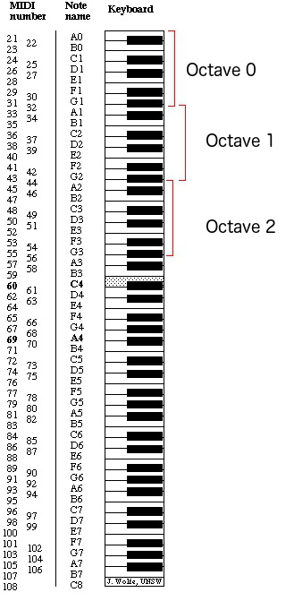

# midi-reduced
2 way translation from midi to a reduced midi form

### Reduced midi form - UPDATE 7/3/18
For use as a condensed musical file form - a more csv friendly specification
to MIDI to be read by RNN models.

One note takes the form:
```
TIME_SINCE_LAST_NOTE_ON, DURATION, OCTAVE0, OCTAVE1, ... OCTAVE7, A, Bb, B, ... G, G#
```

The first two fields are uints, representing time in units of 10 milliseconds.
The next 8 fields represent a one-hot encoding of the octave of the next note.
Numbering begins from the lowest key on the piano, which is sometimes called
'A-1' and remains constant chromatically until the next note A. Note that this
differs from traditional MIDI note naming. The following 12 columns represent
one-hot encodings for musical pitch, starting from A to and ending w/ G#.




### Usage
To convert a midi file into reduced form:
```
python3 midi_to_reduced.py -i <INPUT_MIDI_FILE> -r <RESOLUTION> -o <OUTPUT_REDUCED_FILE>

Example:

python3 midi_to_reduced.py -i moonlight_sonata.mid -r .001
```

This can also be done to a directory containing many midi files. All files will be lumped together in a single reduced output text file with a pause in between each piece of music with user-specified length:
```
python3 midi_to_reduced.py -i <INPUT_MIDI_FILE> -r <RESOLUTION>  -o <OUTPUT_REDUCED_FILE> -p <LENGTH_OF_PAUSE_IN_SECONDS>

```
### File Guide
* midi_to_reduced.py - contains the one-way translation from .mid files to the
reduced text files. Contains one call to midicsv
* reduced_to_midi.py - contains the other one-way translation. Contains one call
to csvmidi
* note_processing.py - contains methods for parsing notestrings/notelists from
inputted csvs
* midi.py - contains framework for handling midi events
* midi_static_data.py - contains midi header and footer
* misc.py - misc.

### Dependencies

This tool requires the ever helpful [midicsv](http://www.fourmilab.ch/webtools/midicsv/) and is written in Python3

### OLD Reduced form
For use as a condensed musical file form, made to be easily readable by a
character based RNN.

Notes are seperated by commas, and each note takes the form
```
<time since last note on><note number><duration>,
```
All time is measured in a resolution not specified in the file (Default 10
  milliseconds). All numeric values are stored with unicode characters, starting
  at UTF-8 Dec# 160.

## Authors

* **Michael Seaman** - *Initial work* - [Michael Seaman](https://github.com/MichaelSeaman), [Machine Music](https://github.com/machine-music/)


## Acknowledgments

* Thanks to [shoogle's midi-csv process](https://github.com/shoogle/midicsv-process) for some code inspiration for the midi module
